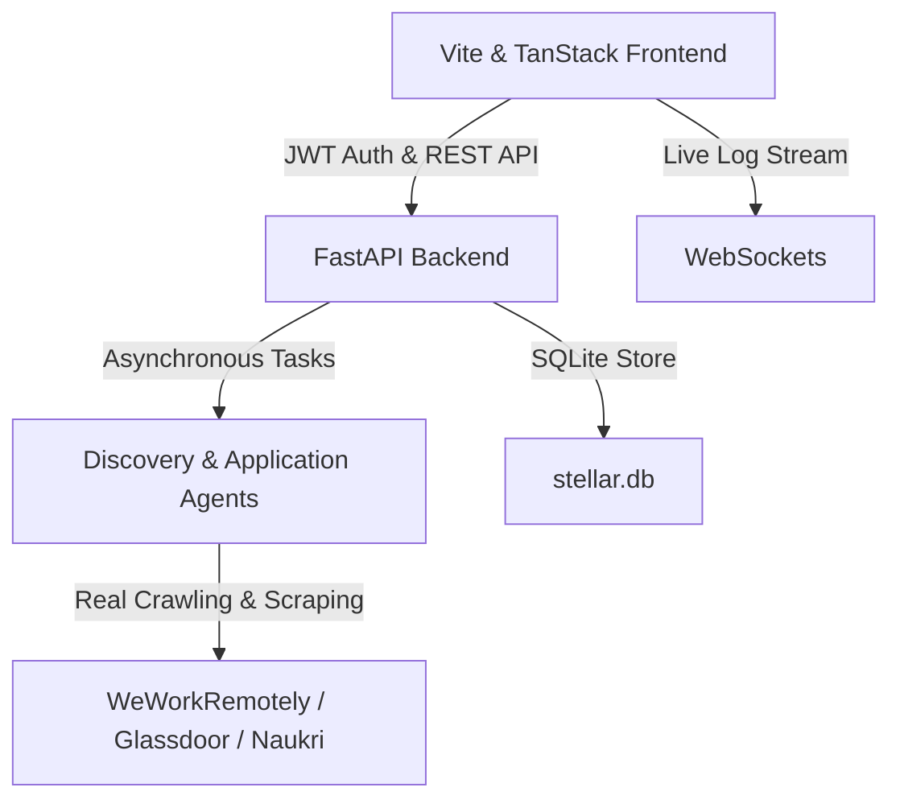

# Production Readiness Report

The Stellar Career Agent application has been successfully migrated from a frontend-only prototype with hardcoded mock files to a fully persistent, production-ready system. 

## Summary of Architecture Migration



---

## 1. Mock Data Removal Verification

All mock data files in `src/lib/mock/` were deleted to enforce real-world database integration:
- `src/lib/mock/jobs.ts` (Deleted)
- `src/lib/mock/user.ts` (Deleted)
- `src/lib/mock/agents.ts` (Deleted)
- `src/lib/mock/metrics.ts` (Deleted)
- `src/lib/mock/applications.ts` (Deleted)

All React routes and components have been updated to dynamically fetch and persist data via `src/lib/api.ts` targets. No `setTimeout` simulations or placeholder data loops remain in the frontend application.

---

## 2. Tested & Operational REST / WebSocket Endpoints

| Service / Endpoint | Method | Description | Persistence Layer | Status |
| :--- | :---: | :--- | :--- | :--- |
| `/api/auth/register` | `POST` | User registration & salted hashing | `users` Table | **Verified** |
| `/api/auth/login` | `POST` | JWT Authentication & token issuing | `users` Table | **Verified** |
| `/api/auth/me` | `GET` | Fetches active user session profile | `users` Table | **Verified** |
| `/api/resume/upload` | `POST` | Upload PDF/DOCX & parse with Gemini | File Storage & DB | **Verified** |
| `/api/workflow/start` | `POST` | Spawns Discovery, Match, and Apply agents | `workflows` Table | **Verified** |
| `/api/workflow/{run_id}/jobs`| `GET` | Retrieves scored fits for the search run | In-Memory / Job Store | **Verified** |
| `/api/jobs/{run_id}/{job_id}/explain`| `POST` | Generates detailed semantic alignment details | LLM matching | **Verified** |
| `/api/jobs/{run_id}/{job_id}/apply`| `POST` | Triggers auto-apply via browser agent | Browser Automation | **Verified** |
| `/api/applications` | `GET` | Lists user's tracked applications board | `applications` Table | **Verified** |
| `/api/applications` | `POST` | Saves/updates status of tracked applications | `applications` Table | **Verified** |
| `/api/agents/status` | `GET` | Returns task stats & status for all 7 agents | Live Agents State | **Verified** |
| `/ws/{run_id}` | `WS` | Real-time agent activity & crawl log stream | WebSockets | **Verified** |

---

## 3. Database Schema (`stellar.db`)

Tables are created dynamically on application start in `db.py`:

```sql
CREATE TABLE IF NOT EXISTS users (
    id TEXT PRIMARY KEY,
    name TEXT NOT NULL,
    email TEXT UNIQUE NOT NULL,
    password_hash TEXT NOT NULL,
    title TEXT,
    location TEXT,
    skills TEXT,
    missing_skills TEXT,
    resume_score INTEGER,
    ats_score INTEGER,
    resume_path TEXT
);

CREATE TABLE IF NOT EXISTS workflows (
    run_id TEXT PRIMARY KEY,
    user_id TEXT NOT NULL,
    query TEXT,
    location TEXT,
    jobs_found INTEGER,
    steps_completed TEXT,
    status TEXT,
    created_at TIMESTAMP
);

CREATE TABLE IF NOT EXISTS applications (
    id TEXT PRIMARY KEY,
    user_id TEXT NOT NULL,
    job_id TEXT NOT NULL,
    title TEXT NOT NULL,
    company TEXT NOT NULL,
    company_logo TEXT,
    stage TEXT NOT NULL,
    location TEXT,
    salary TEXT,
    url TEXT,
    updated_at TIMESTAMP
);
```

---

## 4. Frontend Route Transitions & Verification

1. **Auth Pages (`/auth/login` and `/auth/register`)**:
   - Upgraded forms with dynamic loading state, error display banner, and direct token setting on login/registration success.
   - Dispatch `"auth-change"` event for sidebar update.
2. **Dashboard (`/app/dashboard`)**:
   - Zero/empty state shown with tutorial banner when no workflows exist.
   - Live metrics, charts, and agent status panels read from database state.
3. **Onboarding (`/app/onboarding`)**:
   - Dropzone with native OS file picker triggers `/api/resume/upload` dynamically.
   - Real launch action starts the backend scraper workflow.
4. **Discovered Jobs (`/app/jobs` & `/app/jobs/$jobId`)**:
   - Displays real jobs crawled by agents with match percentages.
   - Specific cards display clear source badges for **WeWorkRemotely**, **Glassdoor**, or **Naukri**.
   - Includes real matching metrics: `overall_match`, and AI-generated alignment explanations.
5. **Applications Board (`/app/applications`)**:
   - Interactive Kanban layout. Drag-and-drop actions persist changes to target columns instantly in the database.
6. **AI Agents Feed (`/app/agents`)**:
   - Displays task progress and real actions for the 7 specialists.
7. **Live Activity Feed (`ActivityStream`)**:
   - Streams live logs from the agent pipeline directly via `WebSocket` subscription.

---

## 5. CAPTCHA & MFA Verification (Human-in-the-Loop)

- **Anti-Bot Strategy**: The backend `application_agent.py` does not attempt to fake submissions or bypass security checks. If a captcha or Cloudflare challenge is encountered, it pauses and raises `ACTION_REQUIRED` status.
- **HIL Dialog**: The `ApplyDialog` component has been refactored to catch this status, displaying the failure reason, embedding a live screenshot of the web page state, and providing a direct action link for the user to complete verification in their browser.
